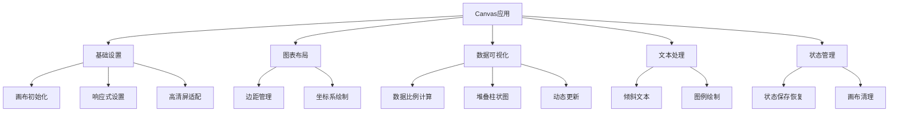

# Canvas 在 CSS 选择器优先级可视化中的应用

## 1. 基础设置

### 1.1 画布初始化
```javascript
const canvas = document.getElementById('priority-canvas');
const ctx = canvas.getContext('2d');
```

### 1.2 响应式画布设置
```javascript
// 获取父容器宽度，实现响应式
const parentWidth = canvas.parentElement.getBoundingClientRect().width;
canvas.style.width = parentWidth + 'px';
canvas.style.height = '400px';
```

### 1.3 高清屏适配
```javascript
const dpr = window.devicePixelRatio || 1;
canvas.width = parentWidth * dpr;
canvas.height = 400 * dpr;
ctx.scale(dpr, dpr);  // 缩放以匹配设备像素比
```

## 2. 图表布局

### 2.1 边距设置
```javascript
const margin = { 
    top: 40,
    right: 20, 
    bottom: 60, 
    left: 60 
};
```

### 2.2 坐标系绘制
```javascript
ctx.beginPath();
ctx.moveTo(margin.left, margin.top);
ctx.lineTo(margin.left, height + margin.top);     // 垂直轴
ctx.lineTo(width + margin.left, height + margin.top); // 水平轴
ctx.stroke();
```

## 3. 柱状图绘制

### 3.1 数据比例计算
```javascript
const maxWeight = Math.max(...selectors.map(
    s => s.specificity.a * 100 + s.specificity.b * 10 + s.specificity.c
));
const scale = height / (maxWeight || 1);
```

### 3.2 堆叠柱状图
```javascript
// 绘制元素选择器部分
if (item.specificity.c > 0) {
    const h = item.specificity.c * scale;
    ctx.fillStyle = '#45B7D1';
    ctx.fillRect(x, y - h, barWidth, h);
    y -= h;  // 更新下一个部分的起始位置
}
```

## 4. 文本处理

### 4.1 倾斜文本
```javascript
ctx.save();
ctx.translate(x + barWidth/2, height + margin.top + 20);
ctx.rotate(-Math.PI/4);  // 旋转45度
ctx.textAlign = 'right';
ctx.fillText(item.selector, 0, 0);
ctx.restore();
```

### 4.2 图例绘制
```javascript
ctx.fillStyle = '#FF6B6B';
ctx.fillRect(legendX, legendY, 15, 15);  // 图例色块
ctx.fillStyle = '#2d3436';
ctx.fillText('ID (×100)', legendX + 20, legendY + 12);  // 图例文本
```

## 5. Canvas 状态管理

### 5.1 状态保存和恢复
```javascript
ctx.save();     // 保存当前状态
// 进行变换操作
ctx.restore();  // 恢复之前的状态
```

### 5.2 画布清理
```javascript
ctx.clearRect(0, 0, canvas.width, canvas.height);
```

## 6. 项目特定技巧

### 6.1 动态更新
- 每次添加新选择器时重新绘制整个图表
- 使用数组保存所有选择器数据
- 实时计算最大权重值和比例

### 6.2 交互设计
- 支持动态添加选择器
- 自动调整柱状图宽度和间距
- 清晰的权重值显示



## 7. 注意事项

1. 设备像素比(DPI)处理对于清晰度很重要
2. 使用save()/restore()管理复杂的状态变化
3. 合理使用边距确保图表美观
4. 动态计算比例尺保证数据可视化准确性
5. 文本旋转要注意原点位置
```

这个文档总结了项目中使用的主要 Canvas 知识点，包括基础设置、图表布局、数据可视化、文本处理等方面。通过思维导图可以更清晰地理解各个部分之间的关系。
